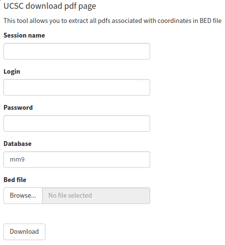

#+KEYWORDS:  UCSC browser, pdf, tracks, download
#+LANGUAGE:  en
#+OPTIONS:   H:4
#+OPTIONS:   num:nil
#+OPTIONS:   toc:2
#+OPTIONS:   p:t
#+OPTIONS: author:nil date:nil

* UCSC pdf downloader

There are two options how you can use this tool:

** GUI options
- open app.R using RStudio and use button "RunApp"
- create account in shinyapps.io and upload app.R as a usual shiny application
** CLI option
- Use the script "ucsc_download_pdf.R" (fill in all parameters in the script's beginning and run script using RStudio or Rscript)

* COMMENT Local vars :noexport:
   ;; Local Variables:
   ;; eval: (add-hook 'after-save-hook (lambda ()(org-babel-tangle)) nil t)
   ;; End:
