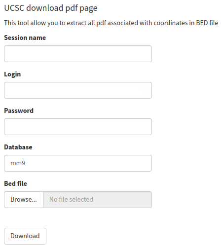

#+KEYWORDS:  UCSC browser, pdf, tracks, download
#+LANGUAGE:  en
#+OPTIONS:   H:4
#+OPTIONS:   num:nil
#+OPTIONS:   toc:2
#+OPTIONS:   p:t
#+OPTIONS: author:nil date:nil

* UCSC pdf downloader

This tool enables the creation of screenshots from UCSC Browser sessions at specific coordinates. Users must provide .BED or .XLSX files containing genomic regions of interest and session information. The script then automatically downloads all screenshots in .PDF format.

[[https://mpyatkov.shinyapps.io/ucscpdf/][Link to Shinyapps]]

** GUI options
- open app.R using RStudio and use button *RunApp*
- create account in shinyapps.io and upload app.R as a usual shiny application

** Session Selection

The app provides two ways to specify your UCSC session:

*** Option 1: Session Discovery (Recommended)
1. Enter your UCSC username and password
2. Click the refresh icon (next to the session dropdown
3. Wait 5-15 seconds for the session list to load
4. Select your session from the dropdown

Note: Session discovery uses headless Chrome (Chromote) to bypass UCSC's Cloudflare protection. This requires Chromium to be installed on the server.

*** Option 2: Manual Entry
- Type the session name directly into the session dropdown field
- This works even if session discovery is unavailable

** Workflow

All PDF downloads now use Chromote (headless Chrome) for:
1. Authentication - bypasses Cloudflare CAPTCHA
2. Navigation - to genomic coordinates
3. PDF extraction - finds and downloads the PDF files

This unified approach ensures reliable authentication and downloads.

** System Requirements

*** Local Deployment
- R with packages: shiny, chromote, rvest, httr, qpdf, readxl, ggpubr, ggplot2, gridExtra, cowplot, stringr, purrr, dplyr, readr
- Chromium browser (for session discovery feature)
  - Ubuntu/Debian: =sudo apt-get install chromium-browser=
  - CentOS/RHEL: =sudo yum install chromium=
  - macOS: Chromium comes with Chrome installation

*** ShinyApps.io Deployment
- Chromote requires Chromium browser on the server
- If Chromium is not available, session discovery will fail gracefully and manual entry can be used
- For full functionality, contact RStudio support about adding Chromium to your ShinyApps.io environment

** Acknowledgements

Created by: Maxim Pyatkov, laboratory of David Waxman, Dept. of Biology, Boston University

Grant support: Development of this script was carried out in the laboratory of David J Waxman, Boston University, supported in part by NIH grants R01-DK121998 (Growth Hormone Regulation of Sex Differences in Liver Metabolism) and R01-ES024421 (Epigenetic Actions of Environmental Chemicals) to DJW.

* COMMENT Local vars :noexport:
   ;; Local Variables:
   ;; eval: (add-hook 'after-save-hook (lambda ()(org-babel-tangle)) nil t)
   ;; End:
